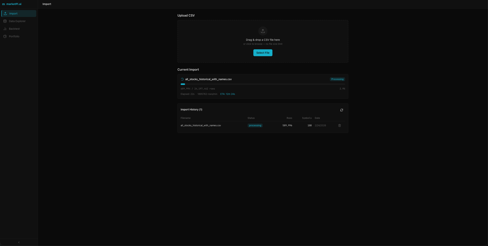
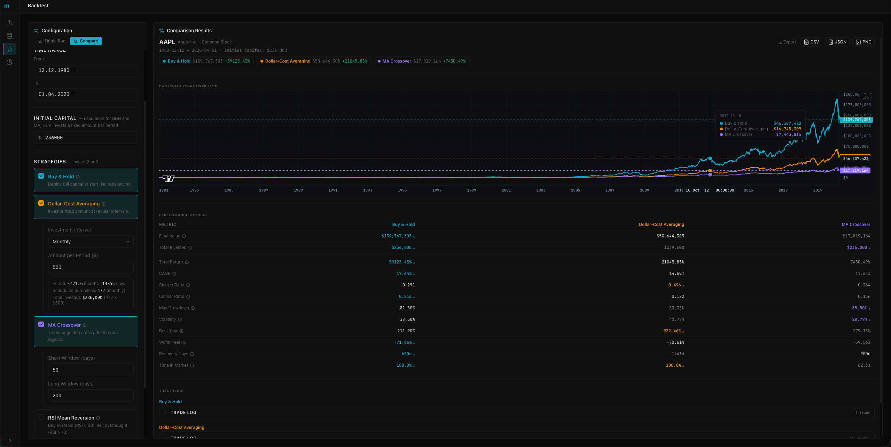
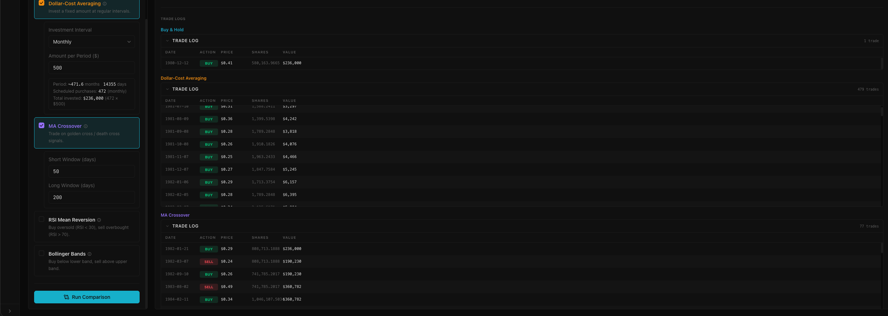
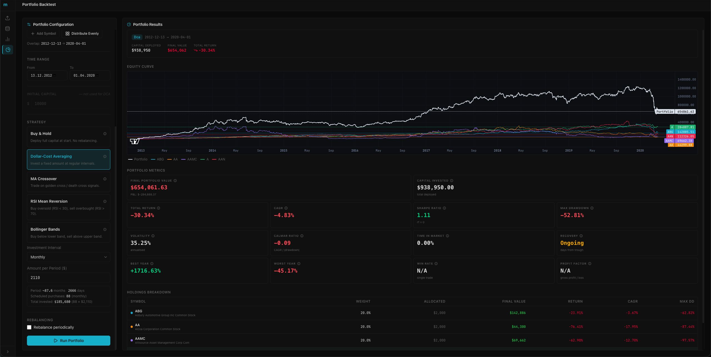
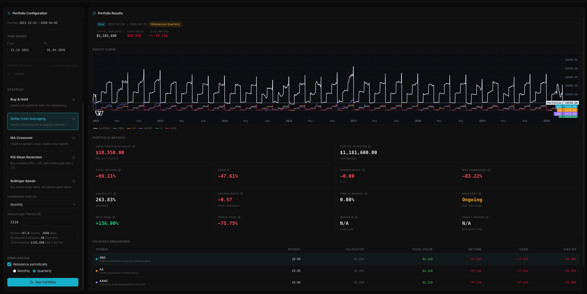

# MarketPl.ai

MarketPl.ai is a small full-stack app for:

- Importing historical stock/ETF prices from a CSV into MongoDB
- Exploring that data in a React UI
- Running strategy backtests (single symbol, compare, and small portfolios)

## Screenshots

| Importing data | Exploring symbol data |
|---|---|
|  |  |

| Single-symbol comparison | Trade logs |
|---|---|
|  |  |

| Multi-ticker backtest | Multi-ticker + rebalancing |
|---|---|
|  |  |

## Tech Stack

- Frontend: React + Vite + TypeScript (app/client)
- Backend: FastAPI + PyMongo (app/backend)
- Database: MongoDB (Docker Compose)

## Prerequisites

- Docker (Docker Desktop on macOS)
- Python 3.11+
- Node.js 18+

## Project Structure

```text
.
├── app/
│   ├── client/          # React UI
│   └── backend/         # FastAPI API
├── data_gathering/      # Helper scripts + example datasets
└── docker-compose.yml   # MongoDB
```

## Quickstart (Local Dev)

### 1) Start MongoDB

From the project root:

```bash
docker compose up -d
```

MongoDB will be available at `mongodb://localhost:27017`.

To stop and remove the container and its data volume:

```bash
docker compose down -v
```

### 2) Start the Backend (FastAPI)

```bash
cd app/backend
python3 -m venv .venv
source .venv/bin/activate
pip install -r requirements.txt
cp .env.example .env
python3 -m uvicorn main:app --reload --host 0.0.0.0 --port 8000
```

Sanity checks:

- Health: http://localhost:8000/health
- DB ping: http://localhost:8000/health/db
- OpenAPI docs: http://localhost:8000/docs

### 3) Run the Backend Tests

With the venv active and from `app/backend`:

```bash
python -m pytest tests/ -v
```

No running MongoDB or server is required — the test suite stubs the database layer and runs fully offline.

### 4) Start the Frontend (React + Vite)

```bash
cd app/client
npm install
npm run dev
```

Frontend runs at http://localhost:5173.

Note: the dev server proxies `/api` to `http://localhost:8000` (see `app/client/vite.config.ts`), so the frontend can call the backend without CORS hassles during development.

## Configuration

Backend environment variables (see `app/backend/.env.example`):

- `APP_NAME` (default: `MarketPl.ai API`)
- `MONGODB_URI` (default: `mongodb://localhost:27017`)
- `MONGODB_DB_NAME` (default: `marketpl`)
- `ALLOWED_ORIGINS` (comma-separated, default includes `http://localhost:5173`)
- `CSV_CHUNK_SIZE` (default: `10000`)

## Importing Data

### CSV format

The backend expects the CSV header to match exactly:

```text
Symbol,Security Name,Date,Open,High,Low,Close,Adj Close,Volume
```

### Import via UI

Open the frontend and use the **Import** page:

- http://localhost:5173/import

### Import via API

```bash
curl -F "file=@/path/to/prices.csv" \
	http://localhost:8000/api/imports/upload
```

Then poll status:

```bash
curl http://localhost:8000/api/imports/<import_id>/status
```

## API Endpoints (Backend)

Base URL: `http://localhost:8000`

- Health
	- `GET /health`
	- `GET /health/db`
- Imports
	- `POST /api/imports/upload` (multipart form field: `file`)
	- `GET /api/imports?skip=0&limit=20`
	- `GET /api/imports/{import_id}/status`
	- `DELETE /api/imports/{import_id}`
- Stock prices
	- `GET /api/stock-prices?symbol=AAPL&date_from=2015-01-01&date_to=2020-12-31&skip=0&limit=100`
	- `GET /api/stock-prices/symbols`
- Backtests
	- `POST /api/backtest`
	- `POST /api/backtest/compare`
	- `POST /api/backtest/portfolio`
	- `GET /api/backtest/symbols/{symbol}/date-range`

Backtest strategies supported:

- `buy_and_hold`
- `dca`
- `ma_crossover`
- `rsi`
- `bollinger_bands`